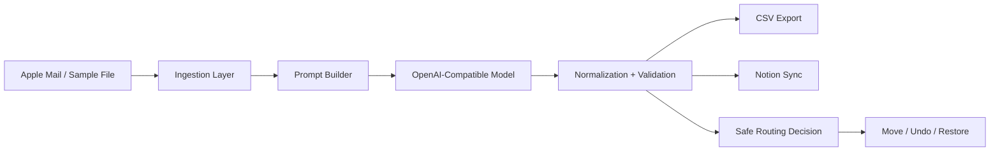
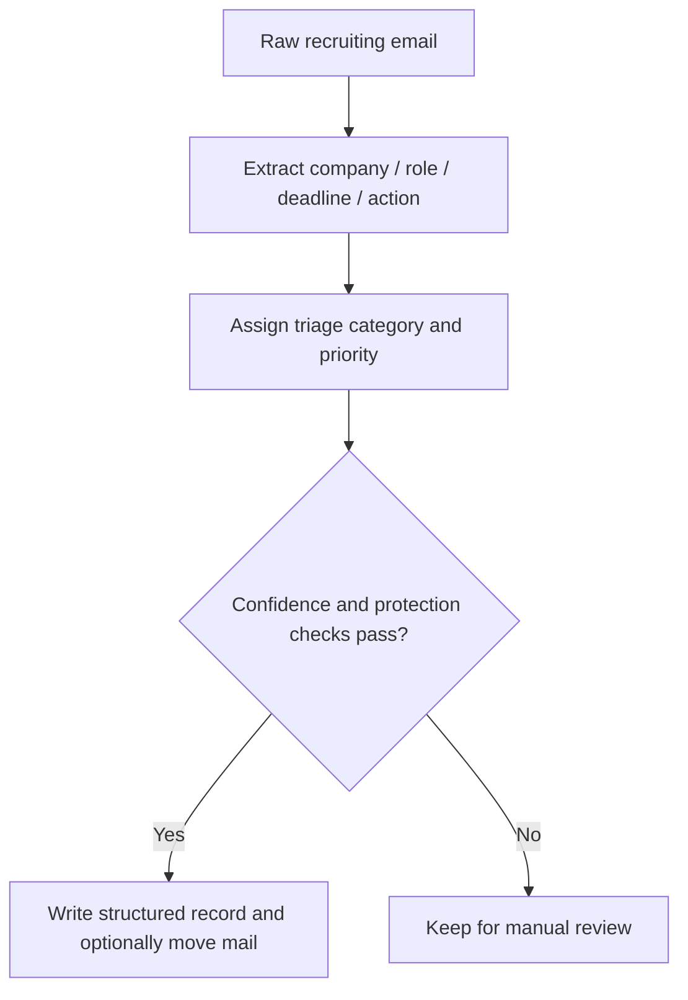

# Shukatsu Mail Copilot

[](https://www.python.org/)
[](https://platform.openai.com/docs)
[](https://developers.notion.com/)
[](./LICENSE)

An AI-powered job hunting email assistant that converts unstructured recruiting emails into structured action items, summaries, and workflow-ready records.

Shukatsu Mail Copilot is a practical automation project that connects Apple Mail, an OpenAI-compatible extraction pipeline, and Notion to reduce the manual overhead of job hunting. It is designed to show end-to-end product thinking: ingestion, LLM prompting, data normalization, safety checks, persistence, and workflow integration.

**日本語サマリー（採用担当者向け）**  
就職活動メールを対象に、Apple Mail からの取り込み、AI による要約・行動抽出、Notion への構造化同期までを自動化する実用プロジェクトです。単なる要約ツールではなく、重要度分類や安全なメール処理も含めて、実際の運用を意識したプロダクト設計を行っています。

## Demo

- Placeholder: `docs/images/demo-mailbox-overview.png`
- Placeholder: `docs/images/demo-structured-output.png`
- Placeholder: `docs/images/demo-notion-sync.png`

Suggested demo order for recruiters:

1. Mailbox view with an incoming recruiting email
2. Structured extraction result in terminal or CSV
3. Final synced record in Notion

## Why I Built This

During job hunting, important emails arrive across multiple companies, event types, and deadlines. The manual workflow quickly becomes noisy: reading long Japanese recruiting emails, identifying deadlines, deciding whether action is required, and then recording the result somewhere else.

I built Shukatsu Mail Copilot to solve that operational pain directly. Instead of treating LLMs as a toy summarizer, this project uses them as one component inside a safer workflow: ingest mail, extract structured fields, normalize output, classify urgency, and sync the result into a system that supports follow-up.

## Overview

Shukatsu Mail Copilot helps organize Japanese job hunting email workflows by reading messages from Apple Mail, extracting structured information with an OpenAI-compatible model, identifying action items, summarizing content, and syncing the results into Notion.

The project started as a practical automation tool for personal job-hunt operations and has been cleaned into a public engineering portfolio repository focused on pipeline design, structured extraction, and cautious automation.

## Features

- Email ingestion from Apple Mail selection or mailbox scan
- Demo-friendly local file ingestion for reviewers
- AI summarization for Japanese job-hunting emails
- Action item extraction and deadline parsing
- Priority and triage classification
- Notion integration for structured tracking
- Structured CSV export
- Safe mailbox routing with protection rules
- Undo and restore support for automated moves

## Tech Stack

- Python
- OpenAI API compatible client
- Notion API
- Apple Mail / AppleScript
- CSV processing with pandas

## Architecture

High-level workflow:

1. Email ingestion from Apple Mail
2. AI extraction into structured JSON
3. Classification and normalization
4. CSV persistence
5. Optional Notion synchronization
6. Optional safe mailbox organization

More detail is in [docs/architecture.md](./docs/architecture.md).





## Repository Structure

```text
src/shukatsu_mail_copilot/   Core pipeline
scripts/                     Local helper launchers
tests/                       Lightweight normalization tests
docs/                        Architecture notes
examples/                    Example inputs
data/                        Generated runtime artifacts (gitignored)
```

## Setup

### 1. Create a virtual environment

```bash
python3 -m venv .venv
source .venv/bin/activate
pip install -e .[dev]
```

### 2. Create your environment file

```bash
cp .env.example .env
```

Fill in:

- `OPENAI_API_KEY`
- `OPENAI_MODEL`
- `OPENAI_BASE_URL` if using a non-default OpenAI-compatible endpoint
- `NOTION_API_KEY`
- `NOTION_DATA_SOURCE_ID`
- `APPLE_MAIL_SOURCE_MAILBOX`

### 3. Run the pipeline

Selected message mode:

```bash
python -m shukatsu_mail_copilot selected
```

Demo mode with a sample file:

```bash
python -m shukatsu_mail_copilot file examples/sample_mail.txt
```

Mailbox scan mode:

```bash
python -m shukatsu_mail_copilot mailbox
```

Dry-run classification:

```bash
python -m shukatsu_mail_copilot classify-dry-run
```

Safe move mode:

```bash
python -m shukatsu_mail_copilot safe-move
```

Undo last move:

```bash
python -m shukatsu_mail_copilot undo-last-move
```

Restore today:

```bash
python -m shukatsu_mail_copilot restore-today
```

## Notion Integration

The current implementation expects a Notion data source with fields for company, position, summaries, sender, category, deadlines, and action status. Optional fields such as confidence and triage category are added when the schema supports them.

## Screenshot Strategy

To make the repository more convincing for recruiters, capture a simple three-image story:

1. `docs/images/demo-mailbox-overview.png`
   Show Apple Mail with one realistic recruiting email selected.
   Goal: communicate the real input source immediately.
2. `docs/images/demo-structured-output.png`
   Show the terminal output or generated CSV row after extraction.
   Goal: prove that the system produces structured results, not just vague summaries.
3. `docs/images/demo-notion-sync.png`
   Show the final Notion database entry with company, deadline, category, and next action.
   Goal: demonstrate workflow completion and practical product value.

Optional extra images if you want a stronger portfolio effect:

4. `docs/images/demo-safe-routing-report.png`
   Show the safe move report table or dry-run output.
5. `docs/images/demo-architecture-slide.png`
   A designed one-page diagram summarizing the pipeline for non-technical reviewers.

## Exactly Which Screenshots To Capture

Capture these specific frames:

1. Apple Mail selected-message view
   Include sender, subject, and visible body content from an anonymized recruiting email.
2. Terminal after running `python -m shukatsu_mail_copilot file examples/sample_mail.txt`
   Include the structured JSON or success output.
3. CSV result opened in Numbers, Excel, or a text editor
   Show columns like company, deadline, category, priority, and next action.
4. Notion database row view
   Show the synced structured record.
5. Safe move report
   Show why a message was moved or kept for review.

Tips:

- Use anonymized data only.
- Blur or replace personal names, addresses, company contacts, and IDs.
- Keep browser tabs and desktop clutter out of frame.
- Prefer 1440px-wide screenshots with readable text.

## Safety and Privacy

- Secrets are loaded from `.env` and should never be committed.
- Runtime outputs are written to `data/` and ignored by Git.
- The safe move flow refuses low-confidence or protected messages.
- This public repository excludes personal logs, historical mailbox data, backups, and app bundles.

## Challenges & Lessons Learned

- LLM output is useful but not reliable enough on its own, so normalization and fallback rules matter just as much as prompt design.
- Workflow automation in a personal productivity context needs safety constraints, not just model accuracy.
- Integrating multiple systems such as Apple Mail, CSV storage, and Notion introduces real product engineering tradeoffs around portability, error handling, and recoverability.
- Building a public-facing repository from a personal automation tool requires a second layer of engineering work: sanitization, documentation, reproducibility, and demo design.

## Future Roadmap

- MCP integration
- Agent workflow orchestration
- Automatic mailbox organization improvements
- Multi-language support

## Recruiter Notes

This repository is strongest when framed as:

- A practical automation tool solving a real workflow problem
- An example of LLM extraction with normalization and safety checks
- A local-first integration project spanning Apple Mail, AI APIs, and Notion
- A project that demonstrates engineering judgment around safety, data shape, and automation risk

To strengthen it further, consider adding:

- Real anonymized fixtures for repeatable evaluation
- Real screenshots in the placeholder locations above
- A small demo video or GIF
- CI for tests and linting
- A clearer separation between provider adapters and core domain logic
- A provider interface that cleanly separates Apple Mail ingestion from the extraction engine

## License

MIT
