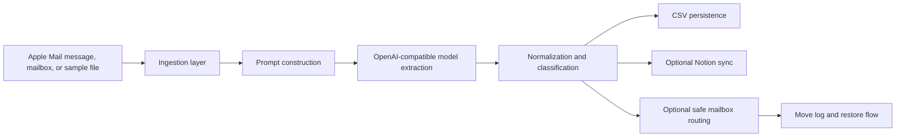

# Architecture

## Workflow summary

1. The pipeline reads either a selected Apple Mail message or every message in a configured mailbox.
2. The raw message is converted into a structured prompt for an OpenAI-compatible chat model.
3. The model returns JSON describing company, position, summary, deadlines, and next actions.
4. Local normalization logic stabilizes the extracted data and maps it into routing categories.
5. Structured records are appended to CSV and optionally pushed into Notion.
6. In safe move modes, the app evaluates confidence and protection rules before moving mail.
